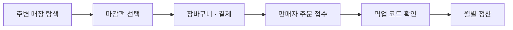
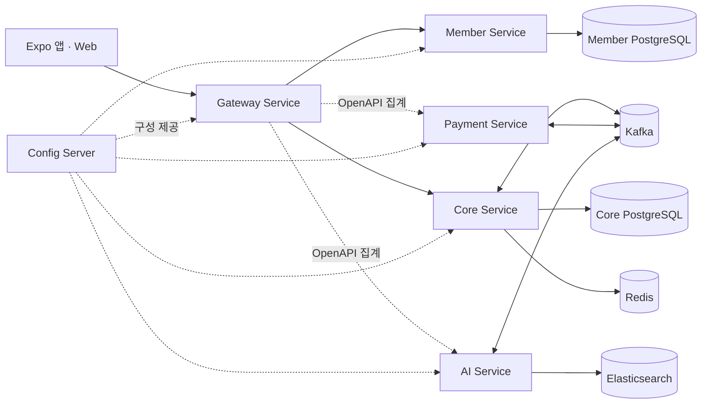

<div align="center">
  
  <h3>남은 맛을, 좋은 가격에.</h3>
  <p>가까운 매장의 마감 할인 음식을 예약하고 픽업하는 로컬 푸드 세이빙 플랫폼</p>

  [](https://github.com/prgrms-be-adv-devcourse/beadv7_7_Congcongpodpod_BE/actions/workflows/backend-services.yml)
  
  
  
  [](LICENSE)

  [제품 둘러보기](https://prgrms-be-adv-devcourse.github.io/beadv7_7_Congcongpodpod_BE/) · [빠른 시작](#빠른-시작) · [아키텍처](docs/architecture.md) · [개발 문서](docs/README.md)
</div>

<br>

## LastDish

영업 종료를 앞둔 매장의 남은 음식을 **마감팩**으로 판매합니다. 구매자는 주변 상품을 찾아 예약·결제한 뒤 정해진 시간에 픽업하고, 판매자는 재고·주문·정산을 하나의 앱에서 관리합니다.

| 구매자 경험 | 판매자 경험 | 플랫폼 기반 |
| --- | --- | --- |
| 지도 기반 주변 매장 탐색 | 매장·상품·재고 관리 | JWT 인증과 역할 기반 접근 제어 |
| 장바구니와 예치금 결제 | 주문 접수와 픽업 코드 확인 | 한정 재고 동시성 제어 |
| 주문 상태·픽업 코드 확인 | 월별 판매·수수료 정산 | Outbox 기반 이벤트 전달 |
| 찜·포인트·등급·알림 | AI 상품 카테고리 추천 | 서비스별 데이터 소유권 분리 |

## 핵심 흐름



## 아키텍처



| 구성 요소 | 책임 |
| --- | --- |
| Gateway Service | 외부 요청 진입점, JWT 검증, 역할 기반 라우팅 |
| Member Service | 이메일·카카오 인증, 회원, 알림과 SSE |
| Core Service | 매장, 상품, 장바구니, 주문, 예치금, 포인트, 정산 |
| Payment Service | 결제 연동과 결제 처리 경계 |
| AI Service | 상품 이미지 기반 카테고리 분류 |
| Config Server | 환경별 Spring 설정 제공 |

각 서비스는 자신의 데이터와 도메인 책임을 소유하며 다른 서비스의 테이블을 직접 조회하지 않습니다. 요청·인증·이벤트·오류 계약은 [아키텍처 문서](docs/architecture.md)에 정리되어 있습니다.

## 기술 스택

| 영역 | 기술 |
| --- | --- |
| Client | Expo 55, React Native 0.83, React 19, Expo Router, React Native Web |
| Backend | Java 21, Spring Boot 4.1, Spring Cloud, Spring Data JPA, Flyway |
| Data & Messaging | PostgreSQL, Redis, Kafka, Elasticsearch |
| Infrastructure | Docker Compose, Kubernetes, GitHub Actions, GHCR |
| Quality | Gradle, JUnit, Spotless, ESLint, TypeScript |

## 빠른 시작

### 요구 사항

- Docker와 Docker Compose
- Node.js LTS와 npm
- iOS·Android 네이티브 실행 시 해당 플랫폼의 Expo 개발 환경

### 1. 백엔드 통합 환경

```bash
cp dev/.env.example dev/.env
./dev/local/member-service/generate-jwt-keys.sh
./dev/dev.sh
```

`dev.sh`는 PostgreSQL, Redis, Kafka, Elasticsearch, Config Server와 백엔드 서비스를 빌드하고 실행합니다. 환경변수와 시연 데이터, 서비스별 실행·초기화 방법은 [로컬 개발 가이드](dev/README.md)를 확인하세요.

### 2. 앱과 웹

```bash
cd frontend/react-native
cp .env.example .env.local
npm ci
npm run web
```

네이티브 앱은 같은 디렉터리에서 `npm run ios` 또는 `npm run android`로 실행합니다. 지도·결제 키를 포함한 환경변수는 [프론트엔드 가이드](frontend/react-native/README.md)를 확인하세요.

> [!IMPORTANT]
> `.env`, 개인 키, 결제 키와 클라우드 자격 증명은 커밋하지 마세요. 저장소의 예제 환경변수 파일에는 개발용 기본값 또는 변수 이름만 유지합니다.

## 검증

```bash
# Backend tests and formatting
cd backend
./gradlew test spotlessCheck

# Frontend lint and web production build
cd ../frontend/react-native
npm run lint
npm run web:build
```

백엔드 CI는 변경된 서비스와 공통 모듈의 영향을 계산해 테스트·패키징·컨테이너 이미지 빌드를 수행합니다. 자세한 내용은 [빌드와 CI](docs/backend/build-and-ci.md)를 참고하세요.

## 저장소 구조

```text
.
├── backend/
│   ├── services/        # Gateway, Member, Core, Payment, AI, Config Server
│   └── modules/         # API, MVC, Event, Outbox, Inbox, S3 공통 모듈
├── frontend/
│   └── react-native/    # iOS · Android · Web 공용 Expo 앱
├── dev/                 # Docker Compose 로컬 통합 환경과 개발 도구
├── infra/               # Kubernetes 배포 매니페스트
└── docs/                # 제품, 아키텍처, 개발, 운영 문서
```

## 문서

| 문서 | 내용 |
| --- | --- |
| [문서 인덱스](docs/README.md) | 전체 개발·운영 문서 탐색 |
| [시스템 아키텍처](docs/architecture.md) | 서비스 책임, 인증, 오류, 이벤트 흐름 |
| [Swagger](docs/backend/swagger.md) | 통합 API 문서 사용법 |
| [로컬 통합 환경](docs/infra/local-development.md) | Compose 구성과 로컬 실행 |
| [Kubernetes](docs/infra/kubernetes.md) | 배포 리소스와 적용 순서 |
| [운영 가이드](docs/infra/lastdish-operations.md) | 배포·점검·장애 대응 절차 |

## 기여

일반 변경은 작업 브랜치에서 `develop`으로 Pull Request를 보냅니다. `main`에는 검증된 `develop` 릴리스만 병합합니다.

```text
feature | fix | refactor → develop → main
hotfix → main
```

- PR 제목: `[Feature|Fix|Refactor|Docs|Test|Deploy] 한글 설명`
- 변경 이유와 영향 범위(Config, DB, API, 배포)를 함께 기록
- 관련 테스트와 CI 통과 여부 기록
- 최종 리뷰 전 최신 `develop` 반영

## 라이선스

이 저장소는 소스 열람과 GitHub 약관이 허용하는 서비스 내부 포크를 허용하지만 오픈소스가 아닙니다. 그 범위를 벗어난 사용, 수정, 재배포, 상업적 이용과 서비스 배포에는 사전 서면 허가가 필요합니다. 자세한 조건은 [LICENSE](LICENSE)를 확인하세요.

<p align="center"><sub>LastDish · 버려지기 전에 한 번 더.</sub></p>
