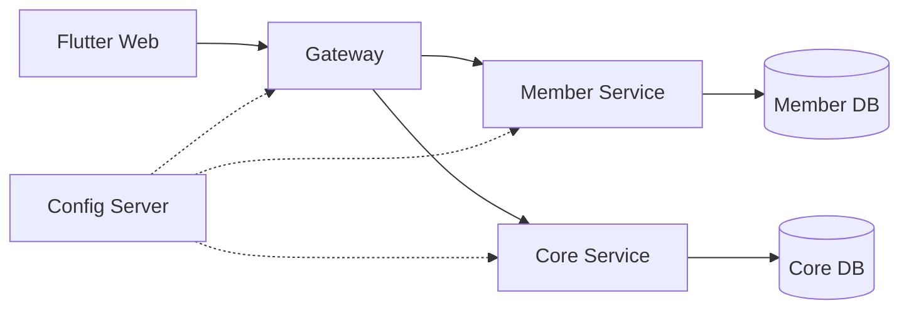

<p align="center">
  
</p>

# LastDish

> 매장 마감 재고를 할인된 가격에 예약하고 픽업할 수 있도록 판매자와 소비자를 연결하는 플랫폼

LastDish는 폐기될 수 있는 마감 재고를 **Surprise Bag(랜덤 마감팩)** 으로 판매합니다.
판매자는 남은 식품을 수익으로 전환하고, 소비자는 양질의 식품을 합리적인 가격에
구매하며, 함께 음식물 폐기로 인한 환경 부담을 줄입니다.

덴마크에서 시작된 잉여 식품 마켓플레이스 **Too Good To Go**의 핵심 경험을 국내 환경에
맞게 재해석했습니다.

## 프로젝트 목표

- 회원가입부터 결제, 픽업, 정산까지 서비스의 전체 흐름 구현
- 한정 수량 상품의 선착순 주문에서 안전한 재고 차감과 동시성 제어
- 결제·예치금의 트랜잭션 통제와 변경 이력 추적
- 서비스별 책임과 데이터 소유권이 분리된 멀티 서비스 구성

## 핵심 비즈니스 모델: Surprise Bag

개별 메뉴를 하나씩 판매하는 대신, 마감 시점에 남은 식품을 하나의 랜덤 구성 상품으로
묶어 판매합니다. 구매자는 정확한 구성품을 미리 알 수 없는 대신 정가보다 **30% 이상
할인된 가격**으로 구매합니다.

- **판매자:** 반복적인 개별 메뉴 관리 없이 상품명, 수량, 가격, 픽업 시간대를 등록
- **구매자:** 주변 매장의 한정 수량 마감팩을 찾아 예약하고 지정 시간에 픽업
- **기술 과제:** 특정 시간대에 집중되는 주문의 재고 정합성과 동시 요청 제어

## 핵심 기능

| 구매자 | 판매자 |
|---|---|
| 위치 기반 주변 매장·상품 조회 | 매장과 마감 할인 상품 관리 |
| 장바구니, 주문, 결제 | 주문 접수와 픽업 처리 |
| 픽업 코드 확인 | 매출 정산과 정산 계좌 관리 |
| 예치금 충전과 내역 조회 | 판매 현황 확인 |

판매자도 구매자 기능을 함께 사용할 수 있습니다.

## LastDish의 차별점

| 구분 | 적용 내용 |
|---|---|
| 예치금 기반 주문 | 선충전한 예치금으로 주문해 반복적인 PG 승인 흐름을 줄입니다. |
| 간편한 판매자 전환 | 일반 회원이 판매자로 전환한 뒤 자신의 매장을 등록할 수 있습니다. |
| 서버 기반 장바구니 | 장바구니와 주문 정보를 서버에 보관해 일관된 구매 흐름을 제공합니다. |
| 정산 자동화 | 월별 판매 금액에서 수수료를 계산하고 매장별 정산 내역을 생성합니다. |

## 도메인 구조

| Context | 주요 책임 |
|---|---|
| Auth / Member | JWT 인증, 회원과 판매자 권한, 프로필 관리 |
| Store / Dish | 매장, Surprise Bag, 판매 수량·시간·상태 관리 |
| Cart | 상품 추가·수정·삭제와 주문 가능 여부 확인 |
| Order / Pickup | 주문 상태 전이, 재고 차감, 픽업 코드 발급·검증 |
| Payment / Deposit | PG 충전, 예치금 증감과 이력, 주문 금액 차감 |
| Settlement | 월별 수수료 계산과 매장별 정산 처리 |

## 시스템 구성



Gateway가 외부 요청의 단일 진입점이며, Member와 Core Service는 각자의 PostgreSQL을
소유합니다. 상세 구조는 [시스템 아키텍처](docs/architecture.md)를 참고합니다.

## 기술 스택

| 영역 | 기술 |
|---|---|
| Frontend | Flutter, Riverpod, GoRouter, Dio |
| Backend | Java 21, Spring Boot, Spring Cloud, JPA, Flyway |
| Data | PostgreSQL |
| Infrastructure | Docker Compose, Kubernetes, GitHub Actions |

## 저장소 구성

- `frontend/`: Flutter 애플리케이션
- `backend/`: Spring Boot 멀티 서비스와 공통 모듈
- `infra/`: 로컬 Docker Compose 설정과 Kubernetes 매니페스트
- `docs/`: 아키텍처, 개발, 운영 문서
- `compose.yaml`: 전체 백엔드 로컬 통합 개발 진입점

## 로컬 실행

백엔드 전체 환경은 저장소 루트의 `compose.yaml`로 실행합니다.

```bash
./infra/local/member-service/generate-jwt-keys.sh
./dev.sh
docker compose ps
```

`dev.sh`는 빌드와 컨테이너 교체가 성공한 뒤, 이번 빌드로 교체된 이전 LastDish 이미지만 삭제합니다. 현재 컨테이너나 다른 컨테이너가 사용하는 이미지는 강제로 삭제하지 않습니다.

특정 서비스만 다시 빌드할 수도 있습니다.

```bash
./dev.sh config-server payment-service ai-service gateway-service
```

초기화할 로컬 데이터 저장소를 하나씩 선택할 수 있습니다. PostgreSQL은 선택한 논리 DB만 재생성하고 해당 서비스의 Flyway를 다시 실행합니다.

```bash
./dev.sh reset member-db
./dev.sh reset core-db
./dev.sh reset payment-db
./dev.sh reset ai-db
./dev.sh reset kafka
./dev.sh reset redis
./dev.sh reset elasticsearch
./dev.sh reset all
```

`all`은 PostgreSQL 네 개 논리 DB, Kafka 메시지·KRaft 데이터, Redis 데이터, Elasticsearch 인덱스를 모두 삭제하고 전체 환경을 다시 빌드·실행합니다.

```bash
cd frontend
flutter pub get
flutter run -d chrome --web-port 3000
```

- Flutter Web: `http://localhost:3000`
- Gateway: `http://localhost:8080`
- Swagger UI: `http://localhost:8080/swagger-ui/index.html`
- Redis: `localhost:6379` (`REDIS_PASSWORD` 미지정 시 개발 전용 비밀번호 사용)
- Kafka: `localhost:9092` (단일 KRaft broker, PLAINTEXT)

환경 준비, 개별 서비스 실행, DB 초기화 방법은 [로컬 통합 환경](docs/infra/local-development.md),
Flutter 설치와 빌드는 [프론트엔드 가이드](frontend/README.md)를 참고합니다.

## 문서

- [문서 전체 목차](docs/README.md)
- [시스템 아키텍처](docs/architecture.md)
- [Gateway와 인증](docs/backend/gateway.md)
- [Kubernetes 구성](docs/infra/kubernetes.md)
- [빌드와 CI](docs/backend/build-and-ci.md)

## 향후 발전 방향

아래 기능은 현재 구현 범위가 아닌 후속 아이디어입니다.

- 판매자가 입력한 상품 설명을 분석한 알레르기 유발 성분 경고
- 판매 이력을 활용한 매장·상품 성향 태깅
- 요일과 시간대별 수요 예측 및 마감팩 수량 추천
- 과거 판매 추이에 기반한 적정 할인율 제안
- 구매·픽업에 따른 환경 기여 기록과 보상 체계
