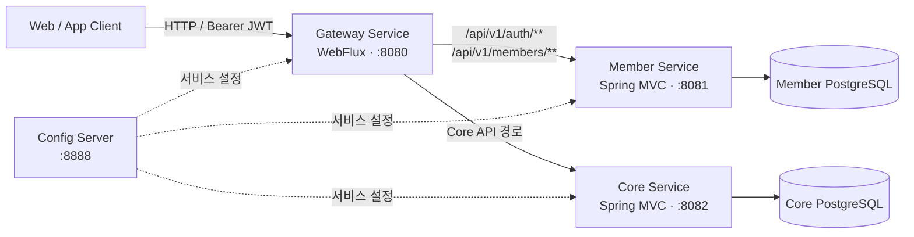
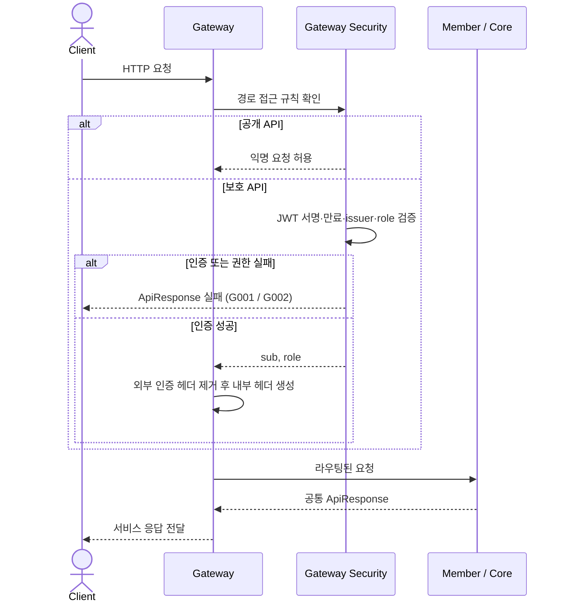
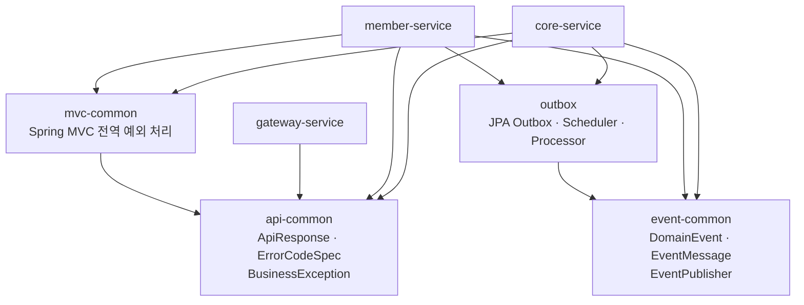
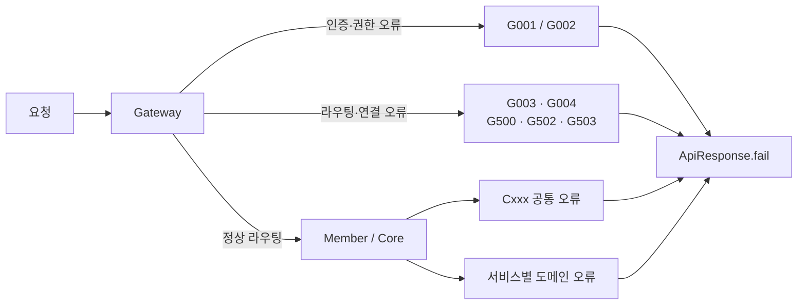
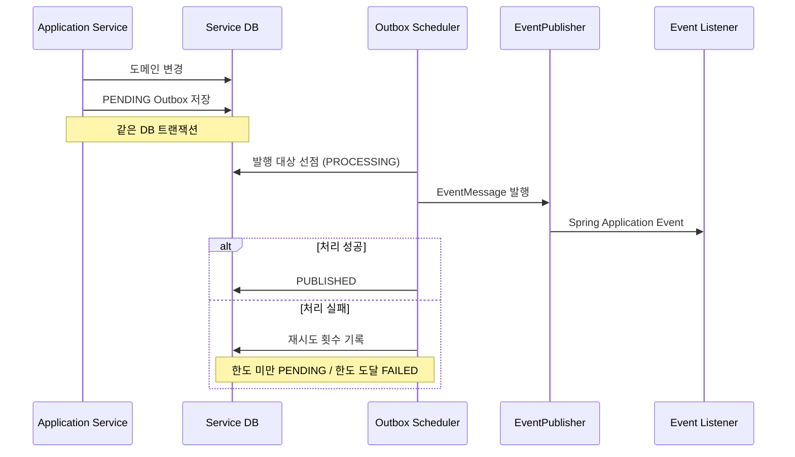

# LastDish 아키텍처

## 개요

LastDish Backend는 Gateway, Member, Core, Config Server로 구성된 Spring 기반 멀티 서비스
시스템입니다. 외부 요청은 Gateway를 통해서만 진입하고 Member/Core Service는 데이터와
도메인 책임을 분리합니다.



## 서비스 책임

| 구성 요소 | 책임 | 저장소 |
|---|---|---|
| Gateway Service | 라우팅, Access Token 검증, 역할 기반 접근 제어, 인증 헤더 생성 | 없음 |
| Member Service | 회원가입, 로그인, 토큰, 회원 도메인 | Member DB |
| Core Service | 가게, 상품, 장바구니, 주문, 결제, 정산, 예치금 | Core DB |
| Config Server | 환경별 애플리케이션 설정 제공 | 로컬 파일 또는 Config 저장소 |

서비스 간 테이블 직접 조회는 허용하지 않습니다. 각 서비스는 자신의 데이터베이스만
소유합니다.

## 요청과 인증 흐름



Gateway가 생성하는 내부 헤더:

- `X-Authenticated-Member-Id`: JWT `sub`
- `X-Authenticated-Role`: JWT `role`

상세 라우팅과 접근 정책은 [Gateway 문서](backend/gateway.md)를 참고합니다.

## 공통 모듈



| 모듈 | 제공 기능 | 등록 방식 |
|---|---|---|
| `api-common` | API 응답과 예외 코드 계약 | 순수 Java 의존성 |
| `mvc-common` | MVC `GlobalExceptionHandler` | Spring Boot Auto-configuration |
| `event-common` | 이벤트 계약과 Spring 이벤트 발행기 | Spring Boot Auto-configuration |
| `outbox` | Outbox 저장, 선점, 발행, 재시도 | Spring Boot Auto-configuration |

Gateway는 WebFlux 기반이므로 MVC 전용 `mvc-common`을 사용하지 않고
`ErrorWebExceptionHandler`로 같은 응답 규격을 구현합니다.

## 오류 처리



- Gateway는 자신이 발생시킨 인증, 권한, 라우팅, 연결 오류만 `Gxxx`로 관리합니다.
- Member/Core의 도메인 오류 코드는 각 서비스에서 관리합니다.
- 하위 서비스 오류 응답은 Gateway가 변경하지 않고 전달합니다.

## 이벤트와 Outbox

현재 기본 `EventPublisher` 구현은 Spring Application Event입니다. 외부 메시지 브로커는
아직 연결하지 않았으며, Outbox Processor가 발행한 이벤트는 같은 애플리케이션 내부
리스너가 소비합니다.



`event-common`은 이벤트 계약과 발행 포트를, `outbox`는 전달 신뢰성을 위한 저장과 처리
흐름을 담당합니다. 향후 Kafka 등의 브로커를 사용할 때는 `EventPublisher` 구현을
교체하고 서비스 간 이벤트 계약을 명시적으로 관리해야 합니다.

## 설정과 실행 환경

- 공통 애플리케이션 설정은 Config Server에서 제공합니다.
- 로컬 Config는 `infra/local/config`에 있으며 Docker Compose가 읽기 전용으로
  마운트합니다.
- `local` 프로필에서 Swagger UI와 통합 OpenAPI 문서를 제공합니다.
- Member/Core의 Outbox 스케줄러는 환경변수로 활성화 여부와 polling/retry 정책을
  조정합니다.

## 코드 구조 원칙

Member/Core 도메인 패키지는 다음 계층을 기본으로 사용합니다.

```text
domain/
application/
infrastructure/
presentation/
```

- `presentation`: HTTP 요청·응답과 검증
- `application`: 유스케이스와 트랜잭션 경계
- `domain`: 엔티티, 값 객체, 도메인 규칙과 저장소 계약
- `infrastructure`: JPA, 외부 시스템, 저장소 구현

공통 모듈에는 특정 서비스의 도메인 오류나 비즈니스 규칙을 넣지 않습니다.
