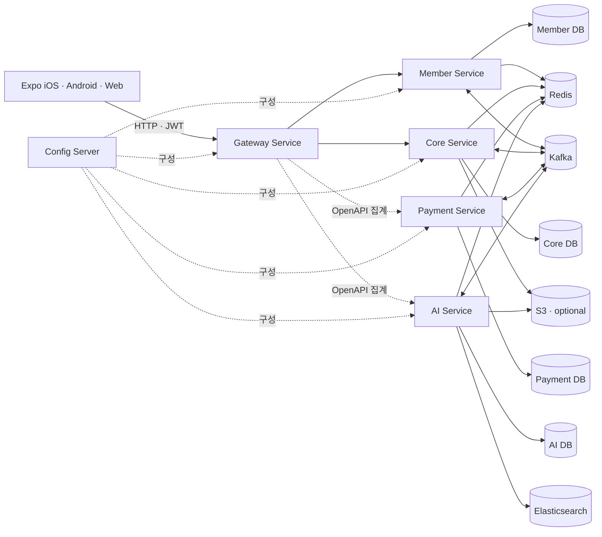
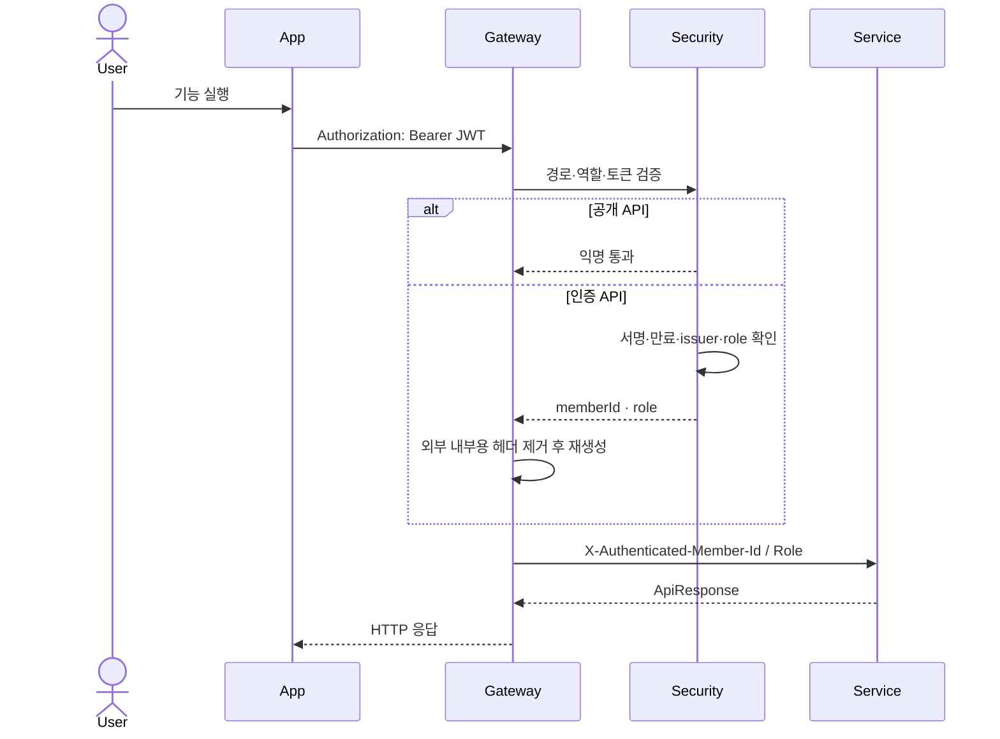
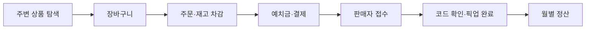
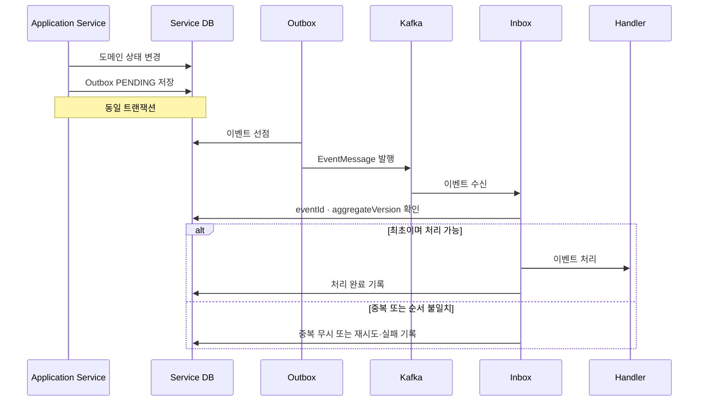
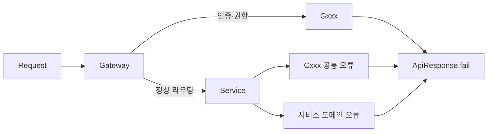

# LastDish 시스템 아키텍처

## 설계 목표

LastDish는 한정 수량 마감팩을 탐색·주문·결제·픽업·정산하는 멀티 서비스 시스템입니다. 서비스별 데이터 소유권, 재고와 결제의 일관성, 이벤트의 재처리 안전성을 핵심 설계 기준으로 둡니다.

## 런타임 구성


```mermaid
flowchart LR
    Client[Expo iOS · Android · Web]
    Gateway[Gateway Service]
    Member[Member Service]
    Core[Core Service]
    Payment[Payment Service]
    AI[AI Service]
    Config[Config Server]

    Client -->|HTTP · JWT| Gateway
    Gateway --> Member
    Gateway --> Core
    Gateway -. OpenAPI 집계 .-> Payment
    Gateway -. OpenAPI 집계 .-> AI

    Config -. 구성 .-> Gateway
    Config -. 구성 .-> Member
    Config -. 구성 .-> Core
    Config -. 구성 .-> Payment
    Config -. 구성 .-> AI

    Member --> MemberDB[(Member DB)]
    Core --> CoreDB[(Core DB)]
    Payment --> PaymentDB[(Payment DB)]
    AI --> AIDB[(AI DB)]
    Member --> Redis[(Redis)]
    Core --> Redis
    Payment --> Redis
    AI --> Redis
    Member <--> Kafka[(Kafka)]
    Core <--> Kafka
    Payment <--> Kafka
    AI <--> Kafka
    AI --> Elasticsearch[(Elasticsearch)]
    Core --> S3[(S3 · optional)]
    AI --> S3
```

로컬 환경에서 Payment DB와 AI DB는 Core PostgreSQL 컨테이너 안의 별도 데이터베이스로 생성되지만, 애플리케이션 계정과 스키마 책임은 서비스별로 분리합니다.

## 서비스 경계

| 서비스 | 소유 도메인 | 주요 연동 |
| --- | --- | --- |
| Gateway | 외부 API 경계, 인증·인가 정책 | JWT 공개키, Redis, 하위 서비스 |
| Member | 인증, 토큰, 회원, 알림 | PostgreSQL, Redis, Kafka, Kakao |
| Core | 매장, 상품, 찜, 장바구니, 주문, 예치금, 포인트, 등급, 정산 | PostgreSQL, Redis, Kafka, S3, Toss, Naver Map |
| Payment | 결제 이벤트와 결제 처리 데이터 | PostgreSQL, Redis, Kafka, Toss |
| AI | 음식 이미지 분류와 추천 후보 | PostgreSQL, Redis, Kafka, Elasticsearch, S3, AI Engine |
| Config Server | 환경별 애플리케이션 설정 | 로컬 파일 또는 Config 저장소 |

서비스는 다른 서비스의 테이블을 직접 조회하지 않습니다. 동기 조회가 필요한 경우 내부 HTTP API를 사용하고, 상태 전파와 후속 처리는 이벤트를 사용합니다.

## 요청과 인증


```mermaid
sequenceDiagram
    actor User
    participant App
    participant Gateway
    participant Security
    participant Service

    User->>App: 기능 실행
    App->>Gateway: Authorization: Bearer JWT
    Gateway->>Security: 경로·역할·토큰 검증
    alt 공개 API
        Security-->>Gateway: 익명 통과
    else 인증 API
        Security->>Security: 서명·만료·issuer·role 확인
        Security-->>Gateway: memberId · role
        Gateway->>Gateway: 외부 내부용 헤더 제거 후 재생성
    end
    Gateway->>Service: X-Authenticated-Member-Id / Role
    Service-->>Gateway: ApiResponse
    Gateway-->>App: HTTP 응답
```

Gateway만 외부 JWT를 신뢰합니다. 하위 서비스는 Gateway가 생성한 내부 인증 헤더를 사용합니다. 세부 경로와 역할 정책은 [Gateway 문서](backend/gateway.md)를 확인하세요.

현재 Config Server의 Gateway 비즈니스 라우트는 Member와 Core API만 선언합니다. Payment와 AI는 통합 OpenAPI 경로가 등록되어 있으며, 외부 API를 추가할 때는 라우트와 `GatewaySecurityConfig` 정책을 함께 변경해야 합니다.

## 주문·픽업·정산 흐름


```mermaid
flowchart LR
    Search[주변 상품 탐색] --> Cart[장바구니]
    Cart --> Order[주문·재고 차감]
    Order --> Payment[예치금·결제]
    Payment --> Accept[판매자 접수]
    Accept --> Pickup[코드 확인·픽업 완료]
    Pickup --> Settlement[월별 정산]
```

- 재고 변경과 주문 생성은 Core Service의 트랜잭션 경계에서 처리합니다.
- 결제와 환불 이력은 금액 변경의 근거를 남기며 멱등 요청을 전제로 처리합니다.
- 픽업 상태는 허용된 상태 전이만 수행합니다.
- 정산은 판매 금액, 플랫폼 수수료와 정산 대상 주문을 분리해 계산합니다.

## 이벤트 전달과 멱등성


```mermaid
sequenceDiagram
    participant Domain as Application Service
    participant DB as Service DB
    participant Outbox
    participant Kafka
    participant Inbox
    participant Handler

    Domain->>DB: 도메인 상태 변경
    Domain->>DB: Outbox PENDING 저장
    Note over Domain,DB: 동일 트랜잭션
    Outbox->>DB: 이벤트 선점
    Outbox->>Kafka: EventMessage 발행
    Kafka->>Inbox: 이벤트 수신
    Inbox->>DB: eventId · aggregateVersion 확인
    alt 최초이며 처리 가능
        Inbox->>Handler: 이벤트 처리
        Inbox->>DB: 처리 완료 기록
    else 중복 또는 순서 불일치
        Inbox->>DB: 중복 무시 또는 재시도·실패 기록
    end
```

- `event-common`: 이벤트 봉투와 발행 포트를 제공하며 설정에 따라 Spring Event 또는 Kafka 구현을 등록합니다.
- `outbox`: 비즈니스 변경과 발행 대상을 같은 DB 트랜잭션에 기록하고 선점·재시도합니다.
- `inbox`: 소비한 이벤트 ID와 aggregate version을 기록해 중복 처리와 역순 적용을 방지합니다.

## 공통 API와 오류

모든 HTTP 서비스는 `api-common`의 `ApiResponse`와 `ErrorCodeSpec` 계약을 공유합니다. MVC 서비스는 `mvc-common`의 전역 예외 처리를 사용하며, WebFlux 기반 Gateway는 같은 응답 형태를 별도로 구현합니다.


```mermaid
flowchart LR
    Request --> Gateway
    Gateway -->|인증·권한| GError[Gxxx]
    Gateway -->|정상 라우팅| Service
    Service --> Common[Cxxx 공통 오류]
    Service --> Domain[서비스 도메인 오류]
    GError --> Response[ApiResponse.fail]
    Common --> Response
    Domain --> Response
```

Gateway는 자신이 발생시킨 인증, 권한, 라우팅, 연결과 타임아웃 오류만 변환합니다. 하위 서비스가 반환한 도메인 오류 응답은 의미를 바꾸지 않고 전달합니다.

## 설정과 관측성

- Config Server가 환경별 Spring 설정을 제공합니다.
- 로컬 Config 원본은 `dev/local/config-server/`입니다.
- Actuator health와 Prometheus endpoint를 서비스 점검에 사용합니다.
- 요청 ID는 Gateway와 MVC 필터를 거쳐 로그와 응답에 연결됩니다.
- Gateway 통합 Swagger는 Member, Core, Payment, AI OpenAPI를 한 화면에서 제공합니다.

## 코드 구성 원칙

도메인 기능은 다음 책임을 기준으로 나눕니다.

```text
presentation/     HTTP 입력·출력과 검증
application/      유스케이스와 트랜잭션 경계
domain/           엔티티, 값 객체, 정책과 저장소 계약
infrastructure/   JPA, Kafka, 외부 API와 저장소 구현
```

서비스마다 도메인 크기에 맞춰 패키지 깊이는 달라질 수 있지만, presentation에서 영속성 구현을 직접 호출하거나 공통 모듈에 서비스별 비즈니스 규칙을 넣지 않습니다.

## 관련 문서

- [문서 인덱스](README.md)
- [Gateway](services/gateway-service.md)
- [Core Service](services/core-service.md)
- [Member Service](services/member-service.md)
- [로컬 통합 환경](infra/local-development.md)
- [Kubernetes 배포](infra/kubernetes.md)
