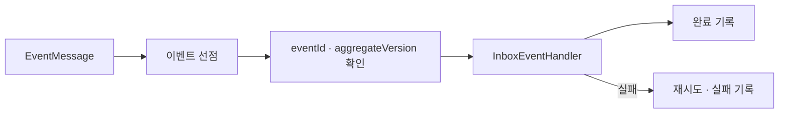

# inbox

소비 이벤트의 멱등성, aggregate별 적용 순서와 실패 이력을 관리하는 Spring Boot 자동 구성 모듈입니다.

## 처리 계약



- 같은 event ID를 중복 처리하지 않습니다.
- aggregate version을 기록해 역순 이벤트 적용을 방지합니다.
- 여러 인스턴스가 같은 이벤트를 동시에 처리하지 않도록 선점합니다.
- 재시도 한도를 넘긴 실패는 원인과 상태를 보존합니다.

## 사용

```gradle
implementation project(':modules:inbox')
```

JPA entity와 repository가 서비스 패키지에서 검색되도록 자동 구성 package registry를 사용합니다. 소비 서비스는 `InboxEventHandler` 구현과 처리 정책을 제공하고, 스케줄러 활성화·배치·재시도 값은 환경 설정으로 관리합니다.

## 주요 구성 요소

| 구성 요소 | 역할 |
| --- | --- |
| `InboxEventWriter` | 수신 이벤트 기록 |
| `InboxClaimService` | 처리 대상 선점 |
| `InboxEventProcessor` | 핸들러 실행과 상태 전이 |
| `InboxAggregateVersion` | aggregate별 마지막 적용 버전 |
| `InboxFailureRecorder` | 실패 원인과 재시도 기록 |
| `InboxScheduler` | 대기 이벤트 polling |
