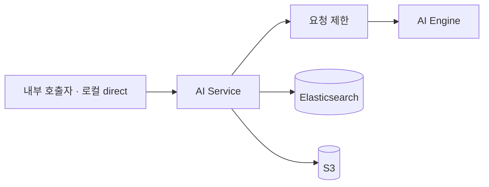

# AI Service

## 책임

AI Service는 판매자가 등록한 음식 이미지를 분석해 상품 카테고리와 신뢰도 기반 추천 후보를 반환합니다.

```text
POST /api/v1/ai/classify
Content-Type: multipart/form-data
```

## 처리 흐름



- `AiController`: multipart 요청과 응답 경계
- `AiService`: 분류 유스케이스
- `FastApiClient`: 외부 AI Engine 호출
- `RateLimitInterceptor`: 분류 요청 제한
- `FoodClassificationResponse`: category, confidence와 추천 후보 응답

## 의존성

- PostgreSQL `ai_db`
- Redis와 Bucket4j
- Kafka, Outbox, Inbox
- Elasticsearch
- S3
- `AI_ENGINE_URL`로 지정한 분류 엔진

현재 Gateway에는 AI OpenAPI 집계 경로만 있고 `/api/v1/ai/**` 비즈니스 라우트는 선언되어 있지 않습니다. 외부 공개 전 Gateway route와 인증 정책을 함께 추가해야 합니다.

## 실행과 검증

```bash
./dev/dev.sh ai-service

cd backend
./gradlew :services:ai-service:test
```

로컬 포트는 `8084`, 컨테이너 내부 포트는 `8080`입니다.
